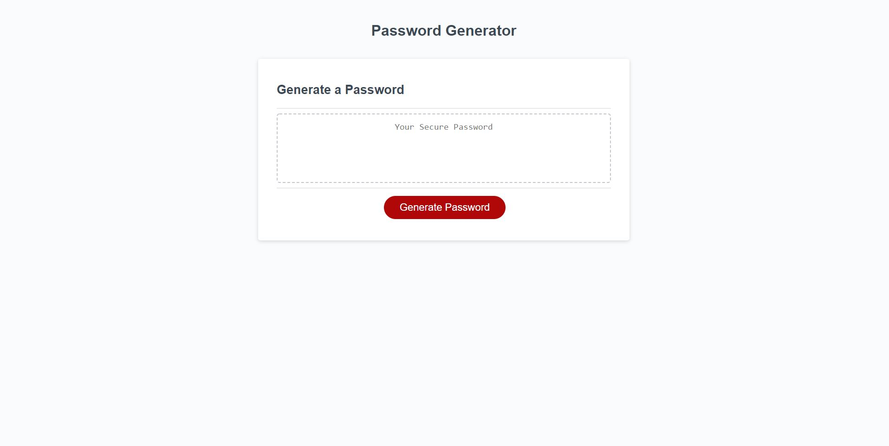

# PasswordGen
This will create a password.
This is a javascript assignment that is meant to fulfill the following critera. 

- When the generate a password button is clicked, it uses a series of prompts for password criteria
- When prompted for password criteria the user is able to select which criteria to include
- The user is able to determine a length between 8 and 128 characters 
- The types of criteria are the following: lowercase, uppercases, numeric, and/or special characters
- The user input should be validated and at least one character type should be selected 
- The password is generated that matches the selected criteria
- the password is generated 
- the password is either displayed in an alert or written to the page. 

The link for PasswordGen: 

https://heatmarie.github.io/PasswordGen/

There are a lot of javascript tools that can be used to get the same output. So I find it fascinating to learn different methods and different techniques that can be used, such as the switch statement. 

The hardest thing for me was knowing where to start. It took time to figure out that I just need to break things down. I can say that writing things out in pseudocode from the beginning would have made all of this much easier. In addition to that, when it came to the end and I thought I was done, I realized that some things have been forgotten about. Such as when I accidnetly hit cancel on the password length and it when through all the other prompts so I had to come up with a solution to fix that.  
